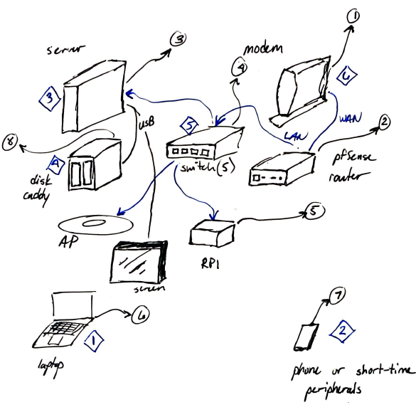

# 13 Oct 2022
Re-connected my \[old\] Github pages to bring to you this blog. It's not a proper blog, but it 
makes me happy because I can write in [markdown](https://www.markdownguide.org/getting-started/)
and version-control it with [git](https://git-scm.com/) and I don't need to worry about hosting
it myself. Because I can't, because my plan did not [survive contact with the enemy](https://idioms.thefreedictionary.com/no+plan+survives+contact+with+the+enemy). 

Centered text

