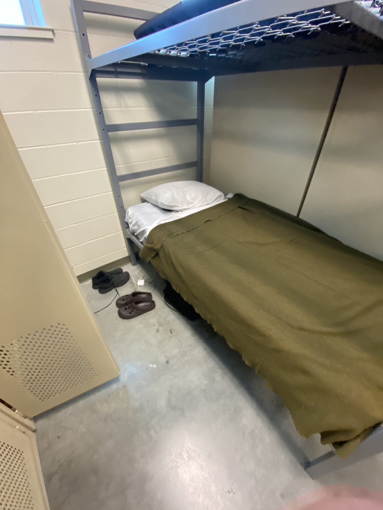
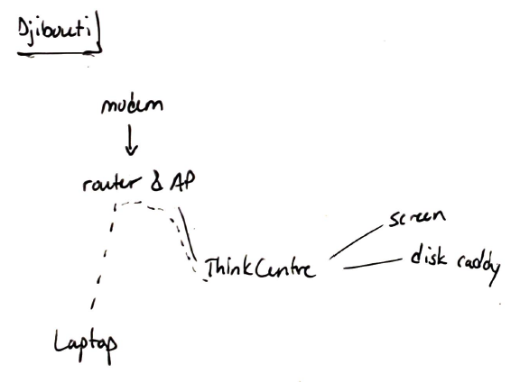

# 13 Oct 2022
Re-connected my \[old\] Github pages to bring to you this blog. It's not a proper blog, but it 
makes me happy because I can write in [markdown](https://www.markdownguide.org/getting-started/)
and version-control it with [git](https://git-scm.com/) and I don't need to worry about hosting
it myself. Because I can't, because my plan did not [survive contact with the enemy](https://idioms.thefreedictionary.com/no+plan+survives+contact+with+the+enemy). 

<i>The plan.</i>

<i>The enemy.</i>

That isn't even where I'm sleeping right now, that was Texas. Now is even more austere, but don't
worry it's not a mud hut. I just had to revise the plan (still theoretical, because I haven't
unpacked my little server and disk drives in the transient housing I'm in). 

<i>On the bright side, this significantly reduced the weight of my bags which were close to the limit.</i>

## Are you confused? 
Since March 2020 I have been running some form of a full-time server at home where I could dabble
in computer-type projects: server administration, programming, automation, web hosting, network
defense, data analysis. Knowing I would leave for nine months I prepared to take the show on the 
road, except that a server is a giant computer that draws an enormous amount of electricity. So 
piece by piece this summer I bought parts to miniaturize my home setup so I could pack a tiny server,
screen, keyboard, and disk array in my airline luggage and set it up in Africa to continue my
hobbies in my free time. I should have taken photos when I had it all plugged in at home during 
rehearsals, I'm sorry. I forgot. 

## What about Africa? 
You are probably here because you want to hear about Africa and not about computers. I need a few
more days to get a handle on some work stuff before I can spill the beans. In the meantime, can
I interest you in some safe-for-public-consumption messaging from our Public Affairs Office? Anywhere
you see "Civil Affairs" or "CABN" in combination with Djibouti, that's most likely the unit we just
came here to replace. We are too recent to have made the homepage yet. 
* [Combined Joint Task Force - Horn of Africa (CJTF-HOA) Civil Affairs](https://www.hoa.africom.mil/spotlight/civil-affairs-battalion-africa)
* [Africa Command (AFRICOM) Mission](https://www.africom.mil/about-the-command/our-team/combined-joint-task-force---horn-of-africa) - with links to social media pages

I wish I could say something about the photos on those pages, but my internet is so slow I can't
get them to load. I'm sure everyone here is on their bunk watching Netflix. 
