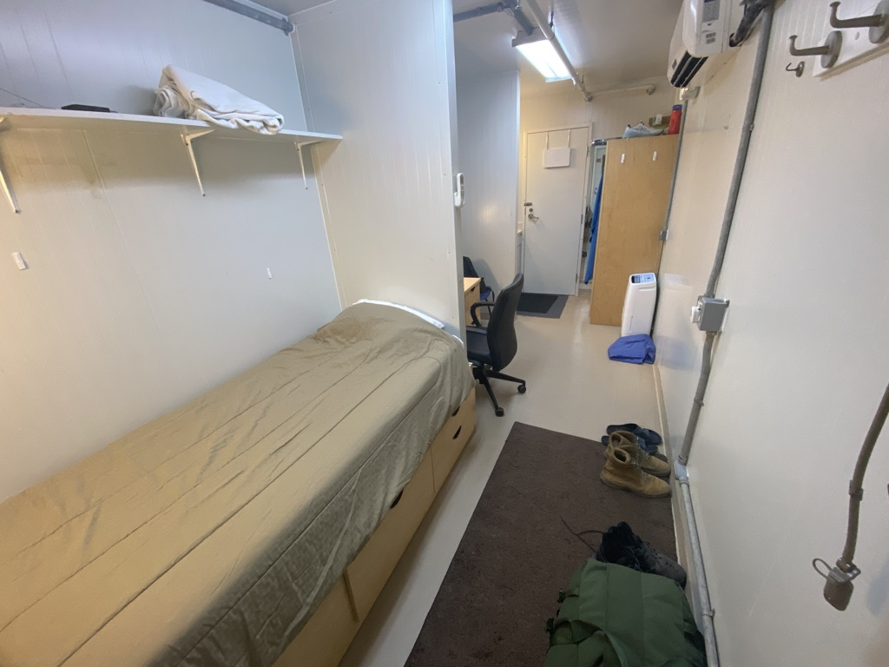
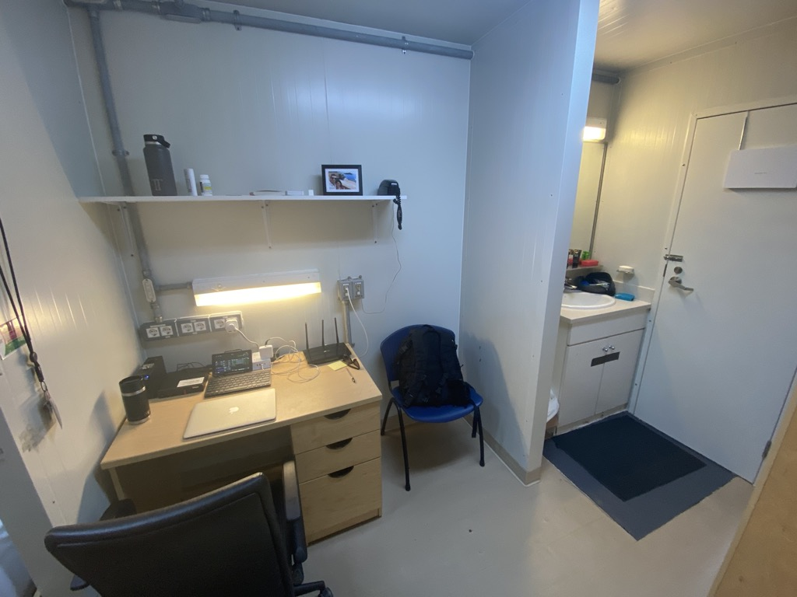
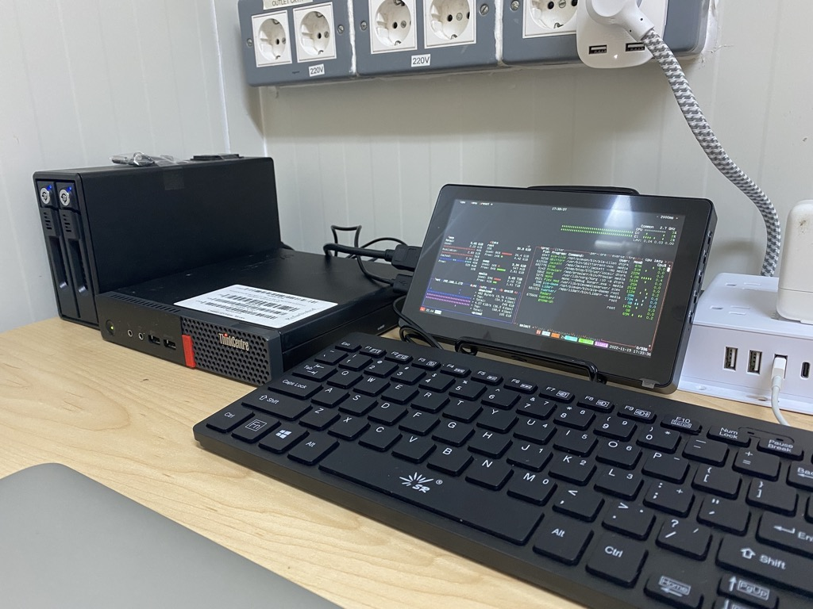
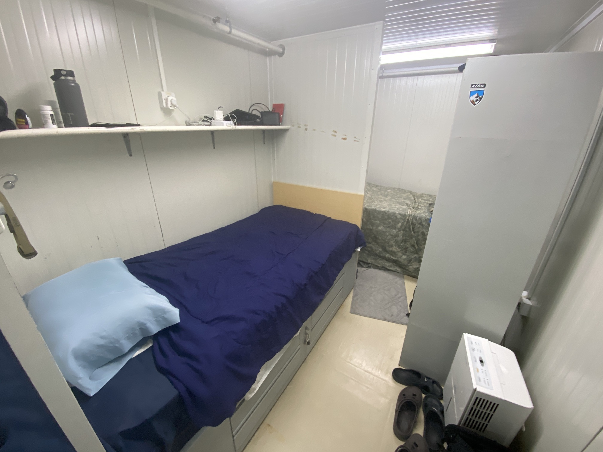
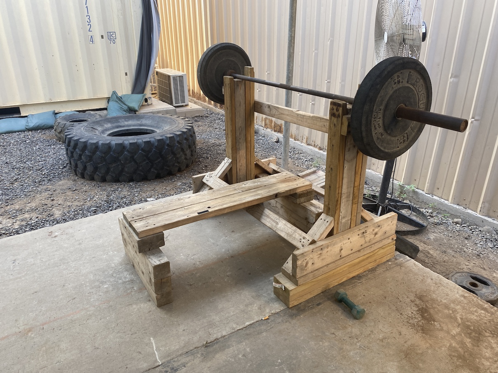

# A Nine-Month Paid Vacation

## 19 Nov 2022 - Living Quarters 2.0
Finally made it to the top of the list to receive my permanent housing for the rest of the 
deployment. Behold: 

<i>All to myself!</i>

This is all a servicemember on deployment could want or dream for: the ability to control the 
thermostat and what time the lights go on or off; a space to walk and stand wider than 18"; not
having to get dressed and go outside to the shower/toilet/sink; enough storage space to not have
to squirrel away my clothes and posessions inside a duffel bag; a proper desk and chair to sit at
instead of sitting atop my bed hunched uncomfortably over a laptop. 

<i>A place to work, a place for "ablutions"</i>

I had been dying to have a better space to set up my server than the narrow shelf above my bed, and
I got exactly that in this new container. At home, I named my server `CR4DL` as an homage to 
[_Westworld_](https://westworld.fandom.com/wiki/Cradle#CR4-DL); this miniaturized version I call
the `CR1B`. 

<i>Welcome to my <code>CR1B</code></i>

From left-to-right that's a two-disk, hot-swappable hard drive caddy filled with a pair of 4TB 
drives formatted as ZFS to act as a single disk for media (all three components off ebay, $113). A
Lenovo ThinkCentre M710q Tiny as the brains, a powerful yet silent piece of hardware (Amazon, $189).
A Sunfounder 7" touchscreen meant for a RaspberryPi (Amazon, $61). It is currently displaying
output from [`btop`](https://github.com/aristocratos/btop) for absolutely no reason at all other 
than the coolness effect (it's generally turned off unless I'm doing maintenance). Mini wired 
keyboard (Amazon, $13). Finally one of these [amazing surge protectors](https://www.amazon.com/gp/product/B09QPF6R4W/)
I found which are engineered so that none of your plugs will ever be covered up by a selfish, 
space-hogging brick of an adapter. 

The beauty of all of this is that internet speeds are terrible here, and streaming services sort
of expect their American audiences to have what is, today, considered a reasonable connection speed
in order to watch content uninterrupted. For example, at home I pay for something like 310 Mbps. 
With 4G LTE on my phone in the States I get about 150 Mbps. Here, it's between 1 and 3. Some nights, 
it's actually more accurate to measure in kilobits per second (Kbps) instead of megabits. 

As a paying customer of these services, I'm afforded the ability to download shows and movies for
offline viewing. But what would ordinarily take me 18 seconds to download now takes at least an hour 
and a half, and I don't want to (or sometimes can't) leave my laptop open or my phone running to 
do that all day. 

I'll spare the details but my dutiful Lenovo ThinkCentre there on the desk _is_
willing and capable to chug along all day and all night fetching these things on a slow-drip 
internet connection, so that when the weekend comes around I can watch an episode or a movie all
the way through. And my historic library of purchased blu-rays and _The Office_ DVD box set came
with me on the hard drives, also immediately available for streaming—not from the world wide web, 
but from my desk setup here, offering a low-latency solution to what (I imagine) is a frustrating
problem to everyone here on base who isn't coughing up at least $155 per month for reasonable
internet speeds. 

<i>That's where all their tax savings go.</i>

## 21 Oct 2022 - Living Quarters

<i>Exactly as small as you think it is.</i>

This is where I live for now, in one half of a shipping container which is further divided into
three alcoves, one bed each. It's what they call transient housing while I move up the waitlist
for permanent housing, which is a whole half of a container to myself! The containers themselves
are CLUs—containerized living units—pronounced "clues". 

We have sleeping CLUs, bathroom CLUs, laundry CLUs, office CLUs, recreation CLUs. Just about the
only thing not done in a CLU is working out. 

<i>Necessity is the mother of invention.</i>

I'm kidding, we have nice gyms. And thrice a day I dine at an all-you-can-eat buffet. And I walk
to work. Life is truly wonderful. 

## 16 Oct 2022 - Re-reading "The Mundanity of Excellence"
From ["The Mundanity of Excellence: An Ethnographic Report on Stratification and Olympic Swimmers"](https://academics.hamilton.edu/documents/themundanityofexcellence.pdf)

> _Excellence is mundane_. Superlative performance is really a confluence of dozens of small 
> skills or activities, each one learned or stumbled upon, which have been carefully drilled into 
> habit and then are fitted together in a synthesized whole. 

## 13 Oct 2022 - The challenge of getting something on the web for you
Re-connected my \[old\] Github pages to bring to you this blog. It's not a proper blog, but it 
makes me happy because I can write in [markdown](https://www.markdownguide.org/getting-started/)
and version-control it with [git](https://git-scm.com/) and I don't need to worry about hosting
it myself. Because I can't, because my plan did not [survive contact with the enemy](https://idioms.thefreedictionary.com/no+plan+survives+contact+with+the+enemy). 

<i>The plan.</i>

<i>The enemy.</i>

That isn't even where I'm sleeping right now, that was Texas. Now is even more austere, but don't
worry it's not a mud hut. I just had to revise the plan (still theoretical, because I haven't
unpacked my little server and disk drives in the transient housing I'm in). 

<i>On the bright side, this significantly reduced the weight of my bags which were close to the limit.</i>

### Are you confused? 
Since March 2020 I have been running some form of a full-time server at home where I could dabble
in computer-type projects: server administration, programming, automation, web hosting, network
defense, data analysis. Knowing I would leave for nine months I prepared to take the show on the 
road, except that a server is a giant computer that draws an enormous amount of electricity. So 
piece by piece this summer I bought parts to miniaturize my home setup so I could pack a tiny server,
screen, keyboard, and disk array in my airline luggage and set it up in Africa to continue my
hobbies in my free time. I should have taken photos when I had it all plugged in at home during 
rehearsals, I'm sorry. I forgot. 

### What about Africa? 
You are probably here because you want to hear about Africa and not about computers. I need a few
more days to get a handle on some work stuff before I can spill the beans. In the meantime, can
I interest you in some safe-for-public-consumption messaging from our Public Affairs Office? Anywhere
you see "Civil Affairs" or "CABN" in combination with Djibouti, that's most likely the unit we just
came here to replace. We are too recent to have made the homepage yet. 
* [Combined Joint Task Force - Horn of Africa (CJTF-HOA) Civil Affairs](https://www.hoa.africom.mil/spotlight/civil-affairs-battalion-africa)
* [Africa Command (AFRICOM) Mission](https://www.africom.mil/about-the-command/our-team/combined-joint-task-force---horn-of-africa) - with links to social media pages

I wish I could say something about the photos on those pages, but my internet is so slow I can't
get them to load. I'm sure everyone here is on their bunk watching Netflix. 
